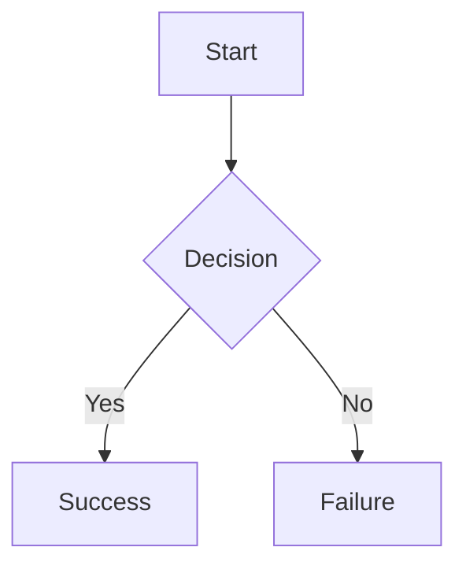

# Markdown Viewer - Usage Guide

## Quick Start

```bash
./view-markdown.sh test-md.md
```

This will:
1. Parse the markdown file
2. Start a local web server
3. Open your default browser
4. Display the file with full formatting

## Features

- ✅ **GitHub-style Markdown** - Tables, task lists, emojis, footnotes
- ✅ **Syntax Highlighting** - 190+ programming languages supported
- ✅ **Mermaid Diagrams** - Flowcharts, sequence diagrams, state diagrams, etc.
- ✅ **Light/Dark Themes** - Auto-detects system preference, manually toggle
- ✅ **Responsive Design** - Works on all screen sizes
- ✅ **Privacy-First** - Everything runs locally, no data leaves your computer

## Supported Markdown

### Basic Formatting
```markdown
# Heading
**bold** *italic* ~~strikethrough~~
`inline code`
```

### Code Blocks
```markdown
```python
def hello():
    print("Hello, World!")
```
```

### Tables
```markdown
| Column 1 | Column 2 |
|----------|----------|
| Data 1   | Data 2   |
```

### Mermaid Diagrams
```markdown

```

### Task Lists
```markdown
- [x] Completed task
- [ ] Pending task
```

### Math (rendered as LaTeX)
```markdown
Inline: $E = mc^2$
Block: $$\int_0^\infty e^{-x^2} dx$$
```

## Mermaid Diagram Types Supported

- Flowcharts (`graph TD`, `graph LR`, etc.)
- Sequence Diagrams (`sequenceDiagram`)
- State Diagrams (`stateDiagram-v2`)
- Class Diagrams (`classDiagram`)
- Entity Relationship Diagrams (`erDiagram`)
- Gantt Charts (`gantt`)
- Pie Charts (`pie`)
- Git Graphs (`gitGraph`)
- Mindmaps (`mindmap`)
- Timelines (`timeline`)
- And many more!

## Theme Control

The viewer automatically detects your system theme preference. You can toggle between light and dark mode using the button in the top-right corner of the browser.

## Stopping the Viewer

Press `Ctrl+C` in the terminal where the script is running. This will:
- Stop the local server
- Clean up temporary files
- Close the viewer

## Examples

```bash
# View a README
./view-markdown.sh README.md

# View documentation
./view-markdown.sh docs/architecture.md

# View notes
./view-markdown.sh ~/notes/project-plan.md

# View the test file
./view-markdown.sh test-md.md
```

## Requirements

- Bash shell
- Python 2 or Python 3 (for local HTTP server)
- Modern web browser (Chrome, Firefox, Safari, Edge)
- Internet connection (first time only, to load CDN libraries)

## Troubleshooting

### "Failed to start local server"
- Make sure Python is installed: `python3 --version` or `python --version`
- Check if port 8080 is already in use

### "File not found"
- Ensure the markdown file path is correct
- Use absolute paths if the file is in a different directory

### Browser doesn't open
- Manually navigate to `http://localhost:8080/viewer.html`
- Check your default browser setting

### Mermaid diagrams not rendering
- Check your internet connection (libraries loaded via CDN)
- Verify mermaid syntax is correct
- Check browser console for errors (F12)

## Performance Tips

- For large files, give the browser a few seconds to render
- Complex diagrams may take longer to render
- The script creates a temporary directory and cleans up automatically

## Privacy & Security

- All rendering happens in your browser (client-side)
- No data is sent to any server
- Markdown content is never uploaded
- Libraries are loaded from reputable CDNs (cdnjs.cloudflare.com)
