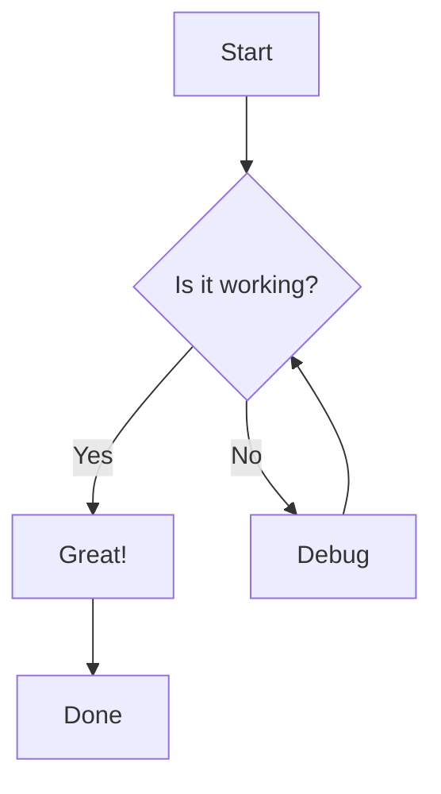
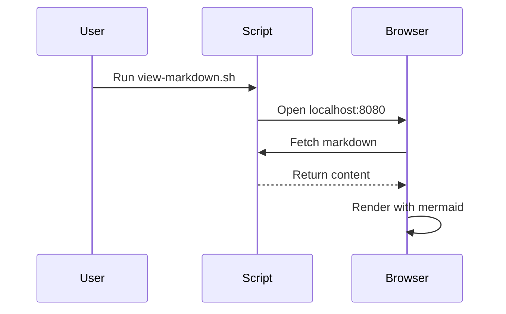
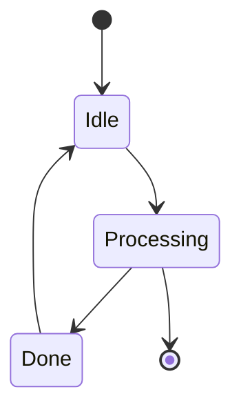

# Test Markdown File

This is a test markdown file to verify the viewer works correctly.

## Basic Markdown

This script supports **bold**, *italic*, ~~strikethrough~~ text.

## Lists

- Item 1
- Item 2
  - Nested item
  - Another nested item

1. First
2. Second
3. Third

## Code

Inline `code` looks like this.

```python
def hello_world():
    print("Hello, World!")
    return True
```

```javascript
function greet(name) {
    return `Hello, ${name}!`;
}
```

## Tables

| Feature | Supported |
|---------|-----------|
| GitHub-flavored Markdown | ✅ |
| Syntax Highlighting | ✅ |
| Mermaid Diagrams | ✅ |
| Dark Mode | ✅ |

## Mermaid Diagrams

### Flowchart



### Sequence Diagram



### State Diagram



## Math (optional)

Inline math: $E = mc^2$

Block math:
$$
\int_0^\infty e^{-x^2} dx = \frac{\sqrt{\pi}}{2}
$$

## Emojis

:rocket: :sparkles: :tada: :100: :heart:

---

Enjoy viewing your markdown files! 🎉
